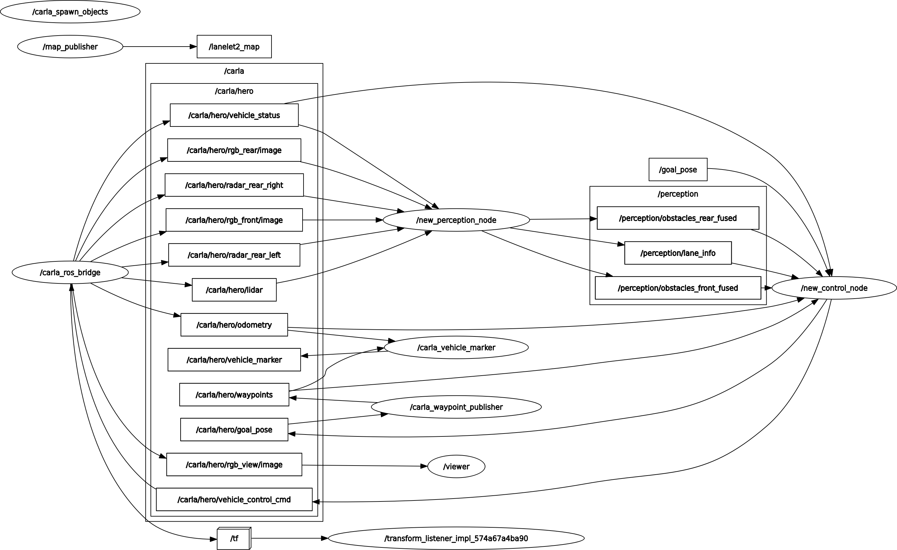

# Lane-Keeping & Automatic Emergency Braking (LKAS-AEB) System

<p align="center">
  
</p>
<!-- <p align="center"></p> -->

## Overview
This project implements an advanced ADAS (Advanced Driver Assistance System) featuring Pure Pursuit Lane Keeping Assist (LKAS) and Automatic Emergency Braking (AEB) capabilities with multi-sensor fusion. Built on the CARLA simulator with ROS2 integration, the system provides:

- **Front Fusion**: RGB camera (YOLOv8) ⊕ LiDAR clusters for in-path obstacle detection
- **Rear Fusion**: Dual short-range radars (left/right) ⊕ rear RGB camera for rear obstacle awareness & safe lane-change gating
- **Kalman Multi-Object Tracking** with data association and distance consistency checks
- **Pure Pursuit Control**: Adaptive path-following algorithm for lane keeping
- **Collision Prediction**: Time-to-collision (TTC) calculation with multi-stage braking  
- **Emergency Braking**: Distance-based and TTC-based braking strategies  

## Reported Results (CARLA 0.9.15)

- **Lane-keeping**: ≤ 0.25 m lateral error at 60 km/h using adaptive lookahead Pure Pursuit (waypoint centerline)
- **AEB**: Critical stop < 500 ms after TTC breach (controller tick + brake command path)
- Validated in 40+ mixed-traffic scenarios (highway, urban, parked-car corridors)

## Key Features

### Perception & Fusion 
- **Object Detection**: YOLOv8 (class-aware) with tracked IDs
- **LiDAR Processing**: ROI clamping, clustering, and 3D centroiding
- **Rear Sensing**: Two side radars for blind-spot/rear closing vehicles; rear RGB for visual confirmation
- **Tracking**: Kalman filter with gating on distance/appearance for stable tracks
- **In-Lane Gate**: Drops obstacles with |y| > (half-lane + margin), eliminating curb-parked false positives

### Control & Safety
- **Adaptive Pure Pursuit**: Speed-dependent lookahead distance for smooth steering  
- **Speed PID Controller**: Adaptive gains with anti-windup and dead zone handling  
- **Multi-Stage AEB**: Warning, critical, and emergency braking thresholds  
- **Velocity Estimation**: Relative speed calculation using tracking history  

### Visualization
- **RViz Integration**: Real-time visualization of sensor data and control commands  
- **Bird’s-Eye View**: Lane visualization from a top-down perspective  
- **Obstacle Tracking**: Visual markers for tracked objects  
- **Trajectory Markers**: Visualization of planned and executed vehicle paths  

## System Architecture

### RQT Graph


## Prerequisites
- Ubuntu 22.04  
- ROS 2 Humble  
- CARLA 0.9.15  
- Python 3.8+  
- NVIDIA GPU (recommended)  

## Installation
1. **Set up CARLA and ROS2 Bridge**  
   ```bash
   # Install CARLA
   sudo apt install carla-simulator

   # Install ROS2 Bridge
   sudo apt install ros-humble-carla-ros-bridge

2. **Create workspace and clone repository**  
   ```bash
    mkdir -p ~/lkas_aeb_ws/src
    cd ~/lkas_aeb_ws/src
    git clone https://github.com/RuntimeTerror/lkas_aeb.git

3. **Install dependencies**  
   ```bash
   cd ~/lkas_aeb_ws
   rosdep install --from-paths src --ignore-src -r -y

4. **Build workspace**  
   ```bash
    colcon build --symlink-install
    source install/setup.bash

## Usage
1. **Launch CARLA Simulator**  
   ```bash
   ./CarlaUE4.sh -quality-level=Epic

2. **Launch ADAS System**  
   ```bash
    ros2 launch lkas_aeb adas.launch.py

## Configuration
The system is highly configurable through YAML parameter files located in config/params/:
- **Perception & Fusion**: perception_params.yaml 
- **AEB**: aeb_params.yaml
- **Lane Change**: lc_params.yaml
- **Lane Keeping Assistant**: lkas_params.yaml 

Key adjustable parameters include:
- Confidence thresholds
- Braking force limits
- TTC thresholds
- PID controller gains
- Region of interest settings

## Custom Messages
- **Obstacle.msg:** Object class, distance, speed, and bounding box
- **ObstacleArray.msg:** Collection of detected obstacles
- **TTC.msg:** Time-to-collision and criticality data